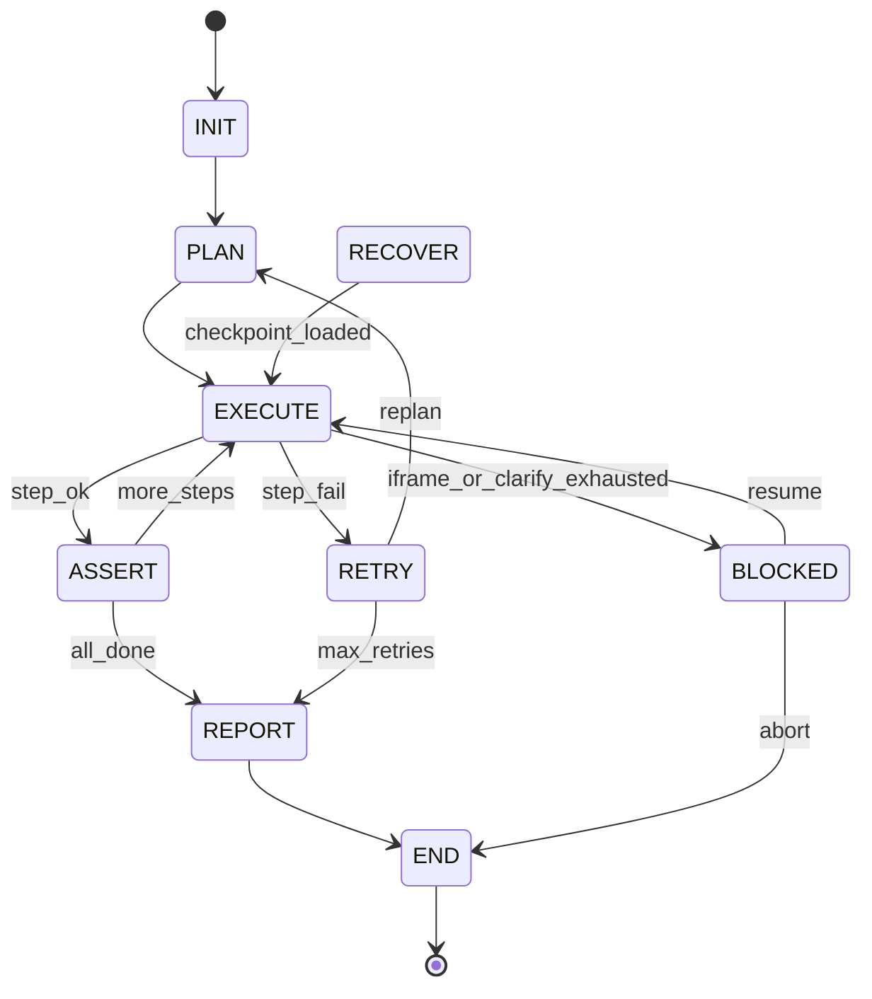

# 附录 C：LangGraph State 定义

实现：`src/ui_test_platform/graph/state.py`, `graph/workflow.py`

## 1. RunState（TypedDict）

```python
class RunState(TypedDict, total=False):
    run_id: str
    tenant: str
    natural_language: str
    status: Literal[
        "INIT", "PLAN", "EXECUTE", "ASSERT",
        "RETRY", "RECOVER", "REPORT", "BLOCKED", "END"
    ]
    resolve_status: Literal[
        "ResolvePending", "Resolved", "Ambiguous", "Failed"
    ]
    plan: dict | None
    ast: dict | None
    current_step_index: int
    retry_count: int
    max_retries: int
    clarify_count: int
    last_snapshot_summary: dict | None
    browser_state: dict
    traces: list[dict]
    error: str | None
    verdict: Literal["success", "fail", "blocked"] | None
    report: dict | None
    pending_clarify: dict | None
```

## 2. 状态节点与边



## 3. 边条件

| 边 | 条件 |
|----|------|
| EXECUTE → ASSERT | `current_step_index >= len(ast.children)` |
| EXECUTE → RETRY | 步骤失败且 `retry_count < max_retries` |
| EXECUTE → BLOCKED | iframe 不可达或 `clarify_count >= max_clarify` |
| RETRY → PLAN | 携带失败上下文，仅重规划**未执行**步骤 |
| ASSERT → EXECUTE | 断言通过但仍有步骤（不应发生；断言通常在末尾） |

## 4. Checkpoint 频率

| 时机 | 持久化内容 |
|------|------------|
| 每个 AST 节点完成后 | 完整 RunState（snapshot 仅摘要） |
| 进入 BLOCKED | 完整 RunState + pending_clarify |
| 进入 REPORT | 完整 RunState + report |

存储后端：

- Phase 0：`MemorySaver` + 本地 JSON trace 文件
- Phase 1：`PostgresSaver`（`langgraph-checkpoint-postgres`）

## 5. browser_state 序列化

```json
{
  "session": "run_abc123",
  "last_url": "https://test.example.com/users",
  "backend": "agent-browser"
}
```

## 6. Trace 条目

```json
{
  "step_id": "s12",
  "action": "click",
  "target": "登录按钮",
  "resolved_ref": "@e5",
  "confidence": 0.94,
  "duration_ms": 1220,
  "status": "success",
  "screenshot_path": "artifacts/abc/s12.png"
}
```
